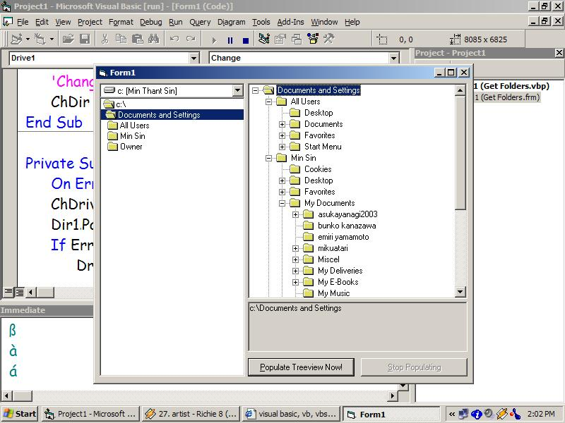



## Treeview \(Take a look\!\!\)

### Description

Simple way to populate treeview with the Dir control. Fully commented. Just a few lines of code. I tried it great readability. Just take a look!!
 
### More Info
 

             |
---                |---
**Submitted On**   |2002-12-03 13:56:52
**By**             |[Min Thant Sin](https://github.com/Planet-Source-Code/PSCIndex/blob/master/ByAuthor/min-thant-sin.md)
**Level**          |Intermediate
**User Rating**    |4.6 (23 globes from 5 users)
**Compatibility**  |VB 6\.0
**Category**       |[Miscellaneous](https://github.com/Planet-Source-Code/PSCIndex/blob/master/ByCategory/miscellaneous__1-1.md)
**World**          |[Visual Basic](https://github.com/Planet-Source-Code/PSCIndex/blob/master/ByWorld/visual-basic.md)
**Archive File**   |[Treeview\_\(1507191232002\.zip](https://github.com/Planet-Source-Code/min-thant-sin-treeview-take-a-look__1-41270/archive/master.zip)

